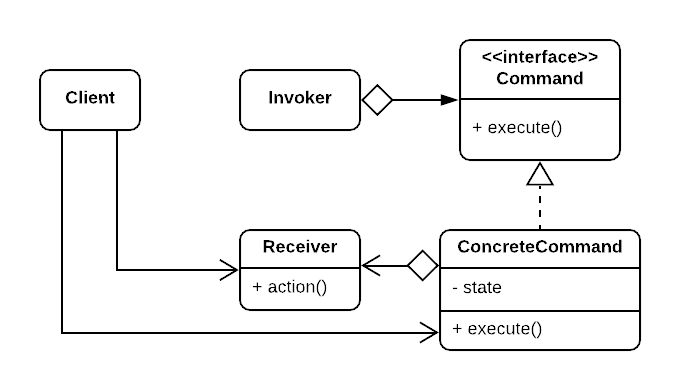

# Command Pattern

Sometimes there're some operations that are done in multiple places in the client code, it even sometimes affect different objects, so it becomes necessary to encapsulate the code away from the client so the client code doesn't know how to operation is done to avoid redundency.

## Intent

Encapsulate an operation as on object that contains all information about the operation, giving the client different operations that can be controlled, manipulated and parametrized by the client (put as a parameter in client code), also to support undoable operations.

## When to use

1. When the client code needs to be parametrized with an action to perform (an object-oriented replacement for callback functions).
2. When you need to support **undo**, as commands can be stored with its states and of course then it should provide an (undo / unexecute) interface for the client code to call.
3. When you want to queue operations, or support scheduling their execution.
4. Support logging the commands when they're executed so they can be reapplied in case of a crash (backups).
5. The same operation is shared across multiple places in the client code.

## Structure

  

- **Command:** declared the interface for executing an operation (may also introduce the interface for undo operation).
- **ConcreteCommand:** defines a binding between the action being executed and the receiver object (so it needs to maintain a reference to the receiver), and implements the execute, and undo by invoking the appropriate corresponding operations in the Receiver. Also its state should be the parameters needed for this operation.
- **Invoker:** asks the command to carry out the request, and it should maintain references (one or more) for the executed commands to be able to support undoable operations (it shouldn't be responsible for creating the commands, instead it should be passed a pre-created command from the client).
- **Receiver:** class contains some business logic. Almost any object may act as a receiver. Most commands only handle the details of how a request is passed to the receiver, while the receiver itself does the actual work (also commands may not have a receiver if they can do the operation by completely themselves).

## Note

The invoker is an optional class in sometimes, but most of the times you'll want one place to manage the execution of the commands to keep track of them.

The Command pattern is usually implemented as prototype pattern, if the commands should be cloned before pushed to the history list or at any other point of time **(see Example 1).**

## Examples

|        Source Code        |  UML   |
| :-----------------------: | :----: |
| [Example 1](example_1.ts) | // TODO |

You can find the tests [here](index.test.ts).
