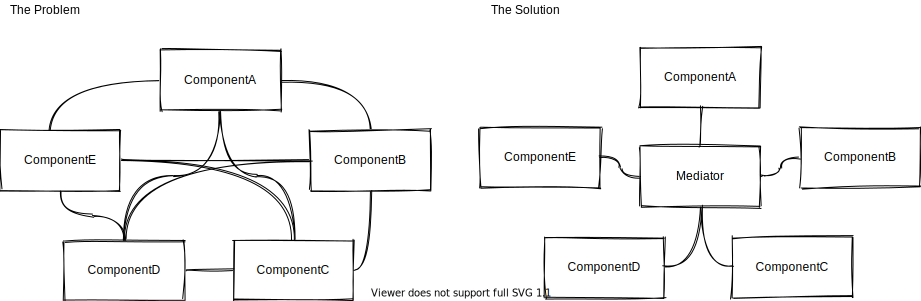
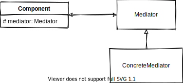

# Mediator Pattern

Mediator pattern is a behavioral pattern that decouples the dependencies of multiple components on each other, forcing them to depend only on the `mediator` class to collaborate.

## Why It Exists

The problem starts to be seen clearly when you have multiple objects that needs to collaborate with each other to do certain functionality, you'll have to make an object of each one inside each of them. So if you have 10 components, each one will have 9 dependencies which will be a lot.

  

The Mediator class will have a dependency with all the 10 components, but each of the 10 components will only have a dependency on the mediator, which will expose functions to make them able to collaborate with each other without knowing about each other.

## When to Use

1. When you have many objects communicating with each other with some complexity resulting in a tight coupling.
2. When you need to be able to reuse any of the objects without being coupled with the other objects (in case you don't need some of them in some scenarios).

## Structure

  

- **Mediator:** defines the interface that facilitates the communication between components.
- **ConcreteMediator:** the concrete implementation for the mediator.
- **Component:** They are multiple classes, each knows the mediator, and uses it to communicate with other components.

## Pros and Cons

🟢 It decouples the components of the system from each other allowing you to be able to reuse each component freely without dealing with its huge dependencies.

🟢 It adheres to the Single Responsibility Principle as it removes the communication logic with other components.

🟢 You can introduce complex new behaviors upon certain actions by sub-classing the mediator only.

🔴 The mediator over time can easily be a `God Object` that is huge in size and coupled with many other components.

## Related Patterns

- [Observer](../observer/README.md) You will often see a mediator class having a behavior very similar to the observer pattern, here the mediator acts as a `Publisher/Subscriber Pattern (Pub/Sub)` in which `observables` don't communicate directly with `subjects` instead they use a mediator to publish and subscribe to events.

## Notes

- You can change the mediator to a `Pub/Sub` pattern to decouple the mediator from its dependencies, now the mediator doesn't know about any component, and the component doesn't know about other components, only components knows about the mediator and talk to each other by publishing and subscribing to certain channels.

- Mediator as it is can be used when you want to make sure a certain sequence of events, as with `Pub/Sub` you can't be sure which call comes first, so you'll need the classic `Mediator` pattern for this, and you may see this sometimes in GUIs when a component want to call or affect changes to some values in other components (a component may be buttons and input fields, and a mediator may be a parent view).

## Examples

| Example                          | Description                    |
| :------------------------------- | :----------------------------- |
| [Example 1](example-1/README.md) | Pub/Sub Pattern Implementation |
