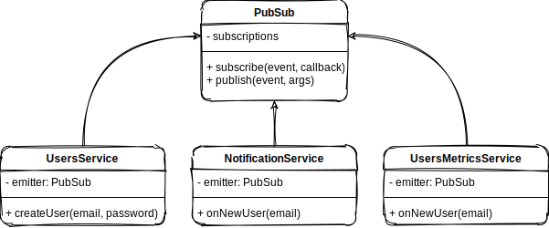

# Example 1

This example is a simple `Pub/Sub` pattern implementation, where the components talk to each other by publishing and subscribing to events through the mediator.

## Mapping The Example to Structure

- PubSub **::** ConcreteMediator
- ServicesClasses **::** Component

## UML

  

## Files

- [Source Code](index.ts)
- [Tests](index.test.ts)
