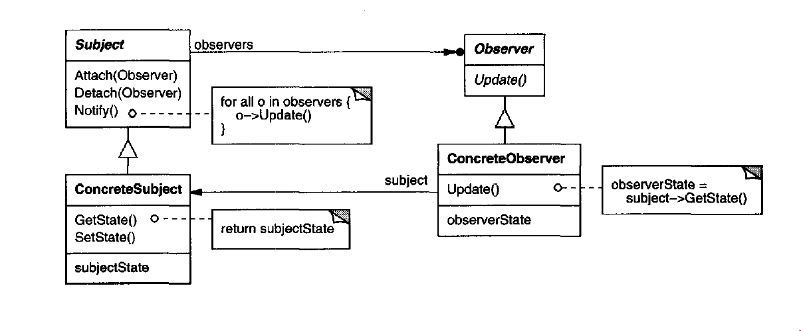

# Observer Pattern

### Intent

Defines a dependency (subscription mechanism) to automatically notify multiple objects (dependents) about any events that happen to the object they're observing.

### When to use

1. When changes to the state of one object may require changing other objects, and the actual set of objects is unknown beforehand or changes dynamically (you don't know who or how many should change).
2. When some objects in your app must observe others, but only for a limited time or in specific cases.
3. When an object should be able to notify other objects without assuming who these objects are (not tightly coupled).

### Structure

  

- Subject: knows its observers, provides and interface for attaching, detaching, and maybe notifying the observers.
- Observer: defines an updating interface for objects that should be notified of changes in a subject.
- ConcreteSubject: stores state of interest to ConcreteObserver objects, and sends notifications to its observers when its state changes.
- ConcreteObserver: maintains a reference to ConcreteSubject object, stores the state, and implements the Observer updating interface to keep its state consistent with the subject's.

### Notes

- **More than one subject to observe:** Sometimes the Observer needs to Observe more than one subject, in this case it's needed to extend the update interface to let the Observer know which subject is sending the notification.
- **Who should trigger the update?** there're two ways to trigger them:
  - Force the calling of notify on the setters of the state of the subject, this way the clients don't have to remember to call Notify on the subject, but there might be redundent or useless update calls.
  - Let the clients be responsible for calling the Notify at the right time. But this is more vulnerable to errors as the client can easily forget to notify the observers.
- **Dangling References:** if the subject is deleted, a memory leak can happen as the Observer is still holding a reference to the subject. One way to avoid dangling references is to make the subject notify its observers as it is deleted.
- **Changing Subject State after Notifying:** when subclassing a subject, we can easily misorder the function calls, so we call the Operation of the base class, then change the state, and forget to Notify the observers. In this case the state is not consistent between Observer, Parent, and Child. To avoid this we can implement the Template Pattern to force the Notify method calling after the update happens, and let subclasses override or even implement the actual logic of the operation.
- **Specifying modifications of interest explicitly:** you can improve the update efficiency by extending the registration interface to allow registration only for specific events of interests.
- **Encapsulating complex update logic:** if there's a complex update operation, we can encapsulate it in a ChangeManager that keeps track of the subjects and observers, which observers are attached to which subjects, how and when to notify (this is an implementation of the mediatior pattern).

## Examples

|        Source Code        |  UML   |
| :-----------------------: | :----: |
| [Example 1](example_1.ts) | _TODO_ |
| [Example 2](example_2.ts) | _TODO_ |

You can find the tests [here](index.test.ts).