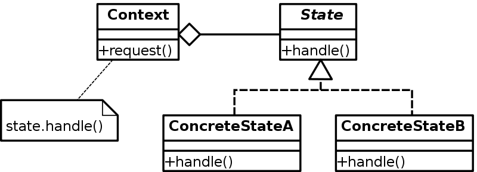

# State Pattern

Sometimes you find yourself in a [**Finite-State Machine**](https://en.wikipedia.org/wiki/Finite-state_machine) problem, where an object has a few states that can interchange at anytime, and the object behaves differently according to each state.

## Intent

Allow an object to alter its behavior when its internal state changes. The object will appear as if it changed its class.

## When to use

1. When the object's behavior depends on its state and it must change its behavior at run-time depending on the state.
2. When you have a class polluted with massive conditionals that alter how the class behaves according to the current values of the class’s fields.
3. When you have a lot of duplicate code across similar states and transitions of a condition-based state machine.

## Structure

  

- **Context:** defines the interface of interest to the clients (usually it's directly a class that holds the state).
- **State:** defines an interface for encapsulating the behavior associated with a particular state of the Context.
- **ConcreteState:** they are the subclasses that implement the different behaviors.

## Note

Applying this pattern can be overkill if a state machine has only a few states or rarely changes.

## Examples

|        Source Code        |  UML   |
| :-----------------------: | :----: |
| [Example 1](example_1.ts) | // TODO |

You can find the tests [here](index.test.ts).
