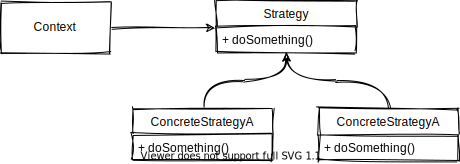

# Strategy Pattern

The strategy pattern intends to encapsulate a family of algorithms in classes that can be injected easily in the client code, so you can determine how the code behaves and which algorithm it uses to do a certain task during runtime.

## Why It Exists

Sometimes you may be tempted to write the algorithm you use inside the client code directly, the problem starts to appear when the algorithm grows big, you'll be violating some principles as the **single responsibility principle** since the client code became responsible to maintain the complex algorithm code, beside the other things as preparing the input, or using the output of the algorithm.
You'll also face a hard time if you want to change the algorithm code when it's coupled between other lines of code, or if you want to provide more than one algorithm to be run at different scenarios the headache of doing this will become a huge deal.

## When to Use

1. When you have multiple algorithms, and you want to be able to change which one you use during run-time.
2. When you need to separate the responsibility of the algorithm code from the client code.
3. When the algorithms are complex and large so you'll achieve a really good separation of concerns, and of course you'll be adhering to the **Open/Closed Principle**, since adding a new algorithm only requires a new file.

## Structure

  

- **Strategy:** defines the interface that's common to all of the algorithms, the client uses the `Strategy` type to inject a `ConcreteStrategy`.
- **ConcreteStrategy:** the concrete implementation for the algorithms.
- **Context:** the context is the object that stores an instance of the `Strategy` and uses it to do a certain action. Remember that it's not the responsibility of the context to choose which strategy to use, instead it's the client code's responsibility.

## Pros and Cons

🟢 It removes the need for conditional statements to choose which strategy to use (although this may be delegated to the client or some other class if you want it to change in runtime based on some condition).

🟢 Inheriting from the base class can factor out all of the common functionality between the concrete strategies.

🟢 Since it implements multiple algorithms, the client may choose different algorithms based on the input to save time, or space.

🔴 Many strategy objects may be instantiated which in some cases may affect the memory, but this can be handled using a registry for the strategies if they are stateless, or even using the **Flyweight Pattern** to factor out common state.

🔴 If the base strategy needs a lot of data for some of the strategies, you may find yourself filling some parameters in the client and the strategy you end up using never uses them.

## Related Patterns

- [Flyweight Pattern](../../structural-patterns/flyweight/README.md) You can build the strategy objects as flyweight to save memory utilizing common states.
- [Template Method Pattern](../template-method/README.md) You can factor out the repeated logic in the strategies in the `AbstractStrategy` to act as a template method pattern.

## Notes

You can also use strategies as functions, strategies are not required to be objects, and you may have seen this before as the `comparator` functions for sorting algorithms on most programming languages.

## Examples

| Example                            | Description                                           |
| :--------------------------------- | :---------------------------------------------------- |
| [Example 1](./example-1/README.md) | An `Error Notifier` that supports multiple platforms. |
