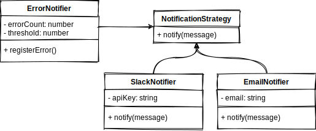

# Example 1

The example is a Notifier Class that sends a notification to a certain platform once and error count threshold is reached.

## Mapping The Example to Structure

- ErrorNotifier **::** Context
- SlackNotifier **::** Concrete Strategy
- NotificationStrategy **::** Abstract Strategy

## UML

  

## Files

- [Source Code](index.ts)
- [Tests](index.test.ts)
