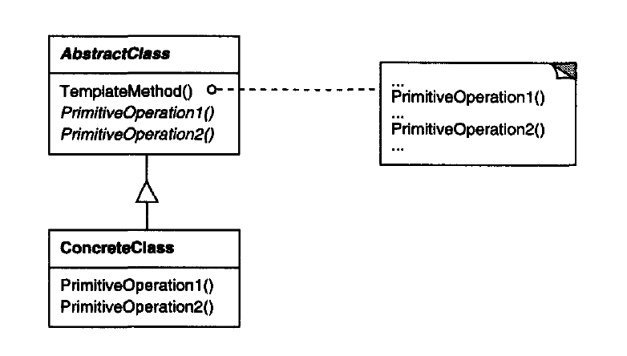

# Template Method Pattern

Define the skeleton of an algorithm, but deferring some steps to subclasses without changing the algorithm's structure.

## When to use

1. Used to implement the invariant parts of an algorithm once, and leave it upto subclasses to implement what varies.
2. When a common behavior among subclasses should be factored in a common clase to avoid duplication (DRY Principle).
3. When you want to let clients extend only particular steps of an algorithm, but not the whole algorithm or its structure.
4. When you need to let the client be able to extend the logic exactly at certain points and no more (using hooks methods).

## Structue

  

- AbstractClass: defines the primitive operations that concrete subclasses define to implement steps of an algorithm.
- ConcreteClass: implements the primitive operations to carry out subclass-specific steps of the algorithm.

## Note

Usually AbstractClass will have abstract steps methods that should be implemented by the ConcreteClass, but there may also be **Hooks Methods** that are optional points of extension of the algorithm.

You may close the overriding of some functions if this is available on the language of implementation.

Template Method is a very good example for Open / Closed Principle.

## Examples

|        Source Code        |  UML   |
| :-----------------------: | :----: |
| [Example 1](example_1.ts) | // TODO |
| [Example 2](example_2.ts) | // TODO |

You can find the tests [here](index.test.ts).
