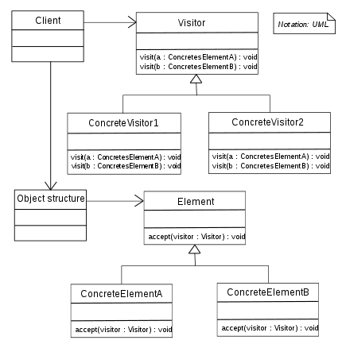

# Visitor Pattern

Sometimes there should be a few operations that are done on a set of object, these operations if implemented directly in each object this means that when an operation is added, a change will occur in every class that supports this operation, which will cause a violation to the OCP and SRP.

## Intent

Represent an operation to be performed on elements of an object structure. It lets you define a new operation without changing the classes on which it operates.

## When to use

1. When you need to perform an operation on all elements of a complex object structure (as trees).
2. Use it to clean up the business logic of auxiliary behaviors.
3. If you want to apply unrelated operations to some classes without polluting them with these operations.
4. When you want to decouple the operations from the object structure, as the structure rarely changes, while the operations are usually extended.

## Structure

  

- **Visitor:** declares the visit operation for each class of ConcreteElement.
- **ConcreteVisitor:** implements each operation declared by the Visitor.
- **Element:** defines the accept operation that takes a visitor as an argument.
- **ConcreteElement:** implements the accept operation then calls the appropriate visit method (one in case of a language that supports overloading) while passing itself as an argument.
- **ObjectStructure:** it's a class that carries a structure of somekind of Elements, it may introduce a form of trees, composite, or even a linear structure, and may provide a high-level interface to allow the visitor to visit its elements **(it's an optional class of course)**.

## Note

You may ask yourself, why is the visitor sent through the accept function to the ConcreteElement then calling the visit method inside the accept. Why not passing directly the ConcreteElement from the client code to the visitor?

Actually the problem here is lying within some object-oriented languages as **C#**, as it uses a static type binding so it will not recognize the dynamic (real) type of the Element, instead it will treat them all as the AbstractElement and of course it'll not be able to find an overload in the visitor for this AbstractElement.

The solution introduced by the Visitor Pattern is commonly known as [**Double Dispatch**](https://refactoring.guru/design-patterns/visitor-double-dispatch).

Also the double dispatch helps to remove the nightmare of if conditions to choose the appropriate visitor function if the language doesn't support method overloading as Javascript, because it delegates the choice to the ConcreteElement instead of the client code.

## Examples

Remember that TypeScript doesn't support **method overloading** so the visitor will have the different overloads as different names.

|        Source Code        |   UML   |
| :-----------------------: | :-----: |
| [Example 1](example_1.ts) | // TODO |

You can find the tests [here](index.test.ts).
