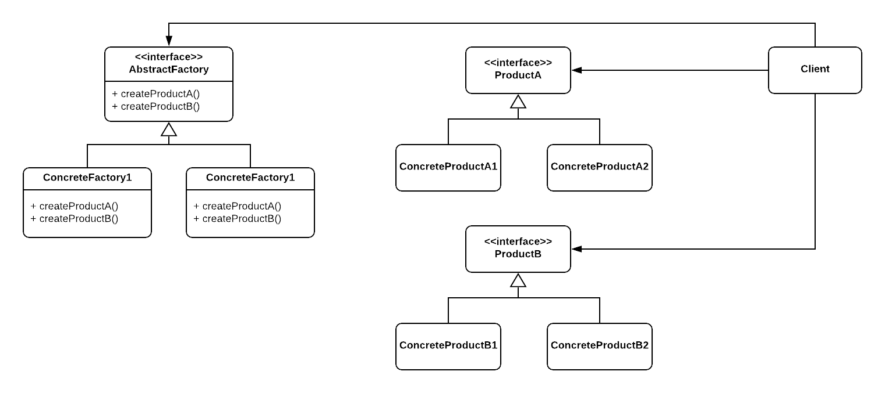

# Abstract Factory Pattern

### Intent

Abstract Factory is a creational design pattern that lets you produce families of related objects without specifying their concrete classes.

### When to use

1. You can't know the type of object you want to create until runtime.
2. You want to encapsulate the object creation logic if some complexity or business logic takes place, or for easier extraction and modification later on.
3. Your system is configured with one of multiple families of products (using Dependency Injection we can easily switch the configuration in runtime).
4. A family of products should be used together.

### Structure

  

- Product: declares the interface of the object the factory method will create.
- ConcreteProduct: implements the Product interface.
- AbstractFactory: declares the factory methods which returns the objects of type Product.
- ConcreteFactory: implements the factory methods to return the instances of ConcreteProducts.

### Note

Abstract Factory can be mentioned as a Factory of Factories, but this kind of implementation/usage is not mentioned in any of the learning sources used to create this repo (GoF Book / Source Making / Wikipedia).

## Examples

|        Source Code        |  UML   |
| :-----------------------: | :----: |
| [Example 1](example_1.ts) | _TODO_ |

You can find the tests [here](index.test.ts).
