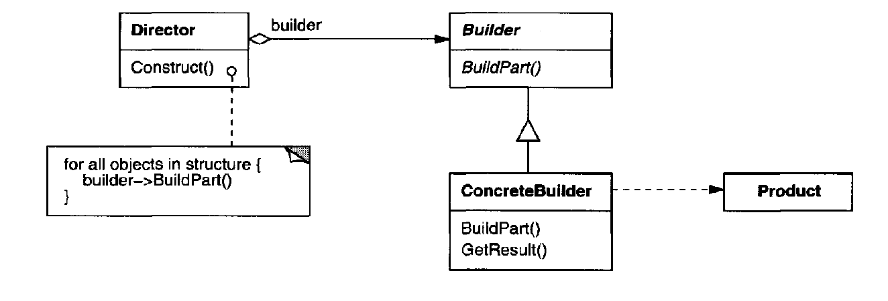

# Builder Pattern

Separates the construction of a complex object from its representation, as that the same construction process can create different representations.

## When to use

1. The algorithm for creating a complex object should be independent of the parts that make up the object and how they're assembled.
2. The construction process must allow different representations for the object that's constructed.
3. You want to get rid of a "telescopic constructor".

## Structure

  

- Builder: defines the interface for creating parts of a product object.
- ConcreteBuilder: constructs and assembles parts of the product by implementing the Builder interface, also keeps track of the representation it creates, and provides an interface to retrieve it.
- Director: constructs an object using the builder interface.
- Product: represents the complex object under construction.

## Examples

|        Source Code        |  UML   |
| :-----------------------: | :----: |
| [Example 1](example_1.ts) | // TODO |

You can find the tests [here](index.test.ts).
