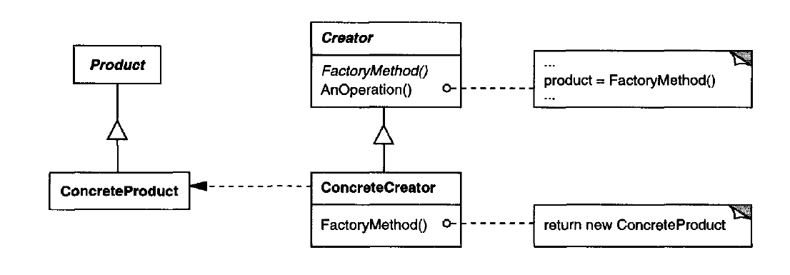

# Factory Pattern

## Intent

Factory Method is a creational design pattern that provides an interface for creating objects in a superclass, but allows subclasses to alter the type of objects that will be created.

## When to use

1. You can't know the type of object you want to create until runtime.
2. You want to encapsulate the object creation logic if some complexity or business logic takes place, or for easier extraction and modification later on.

## Structure

  

- Product: declares the interface of the object the factory method will create.
- ConcreteProduct: implements the Product interface.
- Creator: declares the factory method which returns an object of type Product, it may also implement a basic factory method which can be overriden by subclasses.
- ConcreteCreator: implements the factory method to return an instance of a ConcreteProduct.

## Implementation

Factory method can have 2 types of implementations:

1. Relying on subclasses for the Factory that returns different kind of ConcreteProducts (doesn't violate the O/C Principle, allows for polymorphism, and Dependency Injection).
2. Relying on a paramater (Parametrized Factory) to determine the type of the ConcreteProduct needed.

## Examples

|        Source Code        |  UML   |
| :-----------------------: | :----: |
| [Example 1](example_1.ts) | _TODO_ |
| [Example 2](example_2.ts) | _TODO_ |

You can find the tests [here](index.test.ts).
