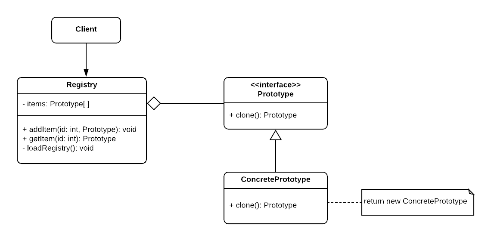

# Prototype Pattern

## Intent

Specify the kinds of objects to create using a prototypical instance, and create new objects by copying this prototype instead of depending on the **new** operator.

## When to use

1. When the object instantiation from the beginning takes a lot of time.
2. When we want to specify an instance of the class to use it as a breeder of all future instances.
3. To avoid building a class hierarchy (seperate classes or factories) that parallels the class hierarchy of the products.
4. If we want to instantiate the same class with a minimal change of state, it's more appropriate to clone the instance and change its state to the required state.

## Structure

  

- Prototype: defines the interface for cloning
- ConcretePrototype: implements the operation for cloning itself.
- Client: creates a new object by asking a prototype to clone itself.
- Registry: **optional** class that saves the frequently used prototypes, either before compilation, or even in runtime.

## Examples

|        Source Code        |  UML   |
| :-----------------------: | :----: |
| [Example 1](example_1.ts) | _TODO_ |
| [Example 2](example_2.ts) | _TODO_ |

You can find the tests [here](index.test.ts).
