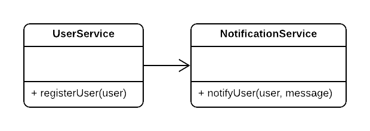

# Dependency Inversion Principle

**Definition:**
High level Modules should not depend on Low level Modules, but both should depend on abstractions.

**The normal flow of module dependencies:** High Level Modules -> Medium Level Modules -> Low Level Modules.


**What we want to achieve:** High Level Modules -> Medium Level Abstractions <- Medium Level Modules -> Low Level Abstractions <- Low Level Modules.


- DI Principle helps in achieving a very decoupled code that helps in extension and testing.
- To achieve true depency inversion, every dependency should be explicit (no new keywords inside the module).
- To achieve explicit dependencies we can use dependency injection either in **Constructors**, **Method Parameters**, **property injection**, or even using **IoC Containers** (Inversion of Control).

## Refactoring to apply DIP

1. Extract Dependencies into interfaces
2. Inject Implementations of interfaces
3. Apply SRP

## Example



```typescript
class UserService {
  public registerUser(user: User) {
    // registration logic

    const notificationService = new NotificationService();
    notificationService.notifyUser(user, "Welcome");
  }
}

class NotificationService {
  public notifyUser(user: User, message: string) {
    // notification logic
  }
}
```

The problem here is actually obvious, the UserService is coupled with this exact NotificationService, testing the UserService alone is impossible, and of course it became much harder to run tests as NotificationService may rely on things not available in the current time (a special mail server or something).

One solution is to make the NotificationService an explicit dependency, but don't forget that **polymorphism** will not work, as NotificationService is a concrete class not an abstraction.

## Solution


```typescript
class UserService {
  private _notificationService;

  public constructor(notificationService: INotificationService) {
    this._notificationService = notificationService;
  }

  public registerUser(user: User) {
    // registration logic

    this._notificationService.notifyUser(user, "Welcome");
  }
}

interface INotificationService {
  notifyUser(user: User, message: string): void;
}

class NotificationService implements INotificationService {
  public notifyUser(user: User, message: string) {
    // notification logic
  }
}
```

Now as the dependency with the NotificationService is decoupled and relies on an abstraction, the NotificationService implementation can be swapped in runtime with other concrete classes that implement the same abstraction.

Also now writing Unit tests for UserService doesn't rely on the NotificationService anymore as a mock can be written to replace the real NotificationService during the tests.
