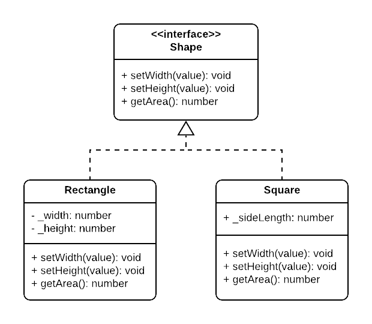
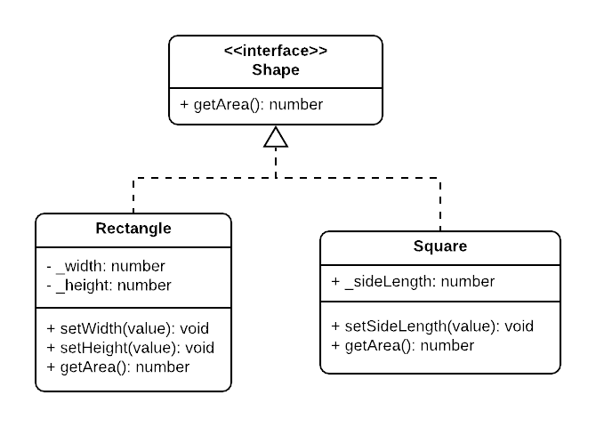

# Liskov Substitution Principle


**Definition:**
Subtypes must be completely substitutable for their base types.

**Substitutability Rules:**

1. Child class mustn't remove a base class behavior.
2. Child class mustn't violate base class objects (manipulated behavior).

- Inheritance can be described as _IS A_ but Liskov says it should be described as _IS Substitutable For_.
- There’s no problem if the child class has extra members but it should not be less (have members with no use or with manipulated behavior).

## Example



```typescript
interface Shape {
  setWidth(value): void;
  setHeight(value): void;
  getArea(): number;
}

class Rectangle implements Shape {
  private _width: number;
  private _height: number;

  public setWidth(value) {
    this._width = value;
  }

  public setHeight(value) {
    this._height = value;
  }

  public getArea() {
    return this._width * this._height;
  }
}

class Rectangle implements Shape {
  private _sideLength: number;

  public setWidth(value) {
    this._sideLength = value;
  }

  public setHeight(value) {
    this._sideLength = value;
  }

  public getArea() {
    return this._sideLength * this._sideLength;
  }
}
```

One of the most famous examples of violating Liskov is when dealing with logical hierarchies in code. We usually want to make an interface Shape that Rectangle, Square, and even Circle will implement.
Although this may make sense logically as they're all shapes, they differ greatly in behavior and can't be substituted without violating LSP.

Square has a Width equal to its Height, so when setting one of them we're also setting the other, but of course this is not explicit for the user of the code and may lead to faulty results.

## Solution



```typescript
interface Shape {
  getArea(): number;
}

class Rectangle implements Shape {
  private _width: number;
  private _height: number;

  public setWidth(value) {
    this._width = value;
  }

  public setHeight(value) {
    this._height = value;
  }

  public getArea() {
    return this._width * this._height;
  }
}

class Rectangle implements Shape {
  private _sideLength: number;

  public setSideLength(value) {
    this._sideLength = value;
  }

  public getArea() {
    return this._sideLength * this._sideLength;
  }
}
```

Now we kept only the real common methods in the interface of Shape, which is _getArea()_ in our case, and now the code returned to be completely substitutable again without any violations for LSP, and without any unexpected behaviors.

Of course in other examples there may be no common methods, then we need to rethink why we want to group them together in the first place.
