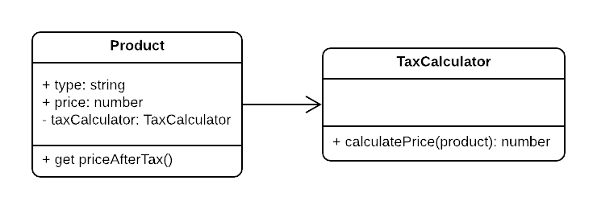
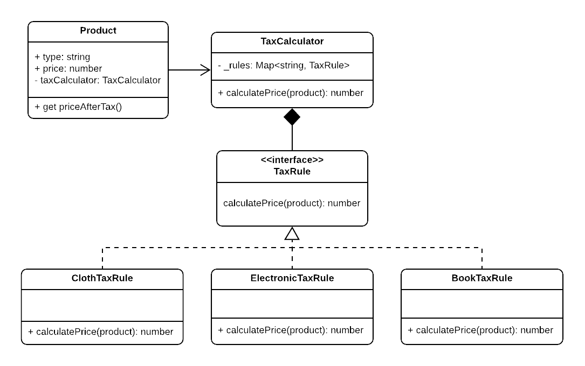

# Open / Closed Principle

**Definition:**
Software modules should be open for extension but closed for modification.

- The modules should accept changes and extensions by adding new classes not by changing existing ones.
- We can rely on abstractions instead of concrete classes to achieve this principle as we can implement an infinite number of these abstractions without any problem.
- Changes to the already existing code is not accepted.

## Example



```typescript
class Product {
  public type: string;
  public price: number;
  private taxCalculator: TaxCalculator;

  public constructor(type, price, taxCalculator) {
    this.type = type;
    this.price = price;
    this.taxCalculator = taxCalculator;
  }

  public get priceAfterTax() {
    return this.taxCalculator.calculatePrice(this);
  }
}

class TaxCalculator {
  public calculatePrice(product: Product) {
    const type = product.type;
    const price = product.price;

    if (type === 'CLOTH') {
      return price * 1.5;
    } else if (type === 'ELECTRONIC') {
      return price * 1.3;
    } else if (type === 'BOOK') {
      return price * 1.1;
    }
    // Other rules may be added!
  }
}
```

Now let's see the problems introduced in this example:

- The rules for tax calculation can be changed in the future as new product types are introduced, and this will require changes to the already existing class TaxCalculator.

## Solution



```typescript
class Product {
  public type: string;
  private _price: number;
  private taxCalculator: TaxCalculator;

  public constructor(type, price, taxCalculator) {
    this.type = type;
    this._price = price;
    this.taxCalculator = taxCalculator;
  }

  public get priceAfterTax() {
    return this.taxCalculator.calculatePrice(this);
  }
}

interface TaxRule {
  calculatePrice(product);
}

class ClothTaxRule implements TaxRule {
  public calculatePrice(product) {
    return product.price * 1.5;
  }
}

class ElectronicTaxRule implements TaxRule {
  public calculatePrice(product) {
    return product.price * 1.3;
  }
}

class BookTaxRule implements TaxRule {
  public calculatePrice(product) {
    return product.price * 1.1;
  }
}

class TaxCalculator {
  private _rules: Map<string, TaxRule>;

  public constructor() {
    this._rules = new Map<string, TaxRule>([
      ['CLOTH', new ClothTaxRule()],
      ['ELECTRONIC', new ElectronicTaxRule()],
      ['BOOK', new BookTaxRule()],
    ]);
  }

  public calculatePrice(product: Product) {
    const type = product.type;
    return this._rules.get(product.type).calculatePrice(product);
  }
}
```

Now we've applied O/C Principle by minimizing as possible the existing code that should be changed when applying a new TaxRule, so we're sure of the minimal side effects of any extension in the future.

Remember that O/C Principle can be a very frustrating and time-consuming principle to apply, so don't usually apply it if you don't see a frequent change in a module, also you can skip applying it for the first time the module is extended, but of course, take the time to refactor the module to apply the O/C Principle in the second time there's a change.
