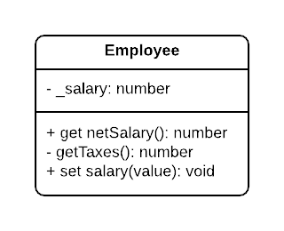
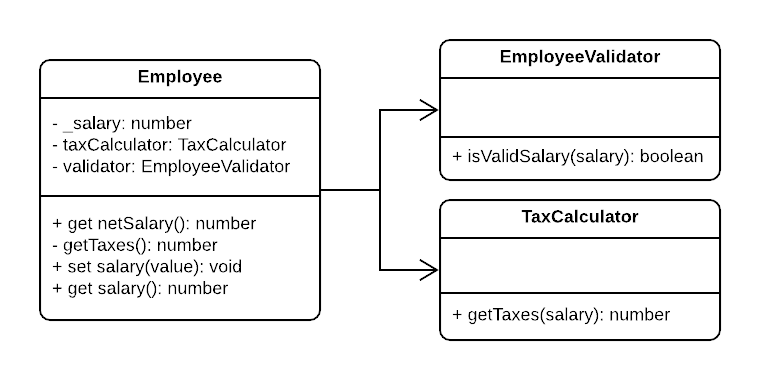

# Single Responsibility Principle

**Robert C. Martin's Definition:**
There should never be more than one reason for a class to change.

**Wikipedia's Definition:**
Every module, class, or function should have responsibility over a single part of the functionality provided by the software, and that responsibility should be entirely encapsulated by the class.

- Requirements changes typically map to responsibilities
- More responsibilities in a class == The class is more likely to have changes
- Having multiple responsibilities within a single class means that these responsibilities are coupled

## Example



```typescript
class Employee {
  private _salary: number;

  public constructor(salary: number) {
    this.salary = salary;
  }

  public set salary(value) {
    if (salary < 0) {
      throw new Error('Salary can not be negative');
    }

    this._salary = salary;
  }

  private getTaxes() {
    // some business logic for tax calculation
    return salary * 0.2;
  }

  public get netSalary() {
    return this._salary - this.getTaxes();
  }
}
```

Now let's see the problems introduced in this example:

- The Validation logic for the salary was put inside the Employee class, so if there's a change to this validation logic the employee must be changed.
- The business logic for tax calculation is also in the Employee class, so it will be very complex to put more than one tax calculation strategy or even change it as it's coupled with the Employee class.
- Now the testing for Employee Unit will force you to test all of the three units together due to their copuling (The Employee itself, the Validation Logic, and the Tax Calculation logic).

## Solution



```typescript
class Employee {
  private _salary: number;
  public get salary() {
    return this._salary;
  }

  private taxCalculator: TaxCalculator;
  private validator: EmployeeValidator;

  public constructor(salary, taxCalculator, validator) {
    this.taxCalculator = taxCalculator;
    this.validator = validator;

    if (this.validator.isValidSalary(salary)) {
      this._salary = salary;
    } else {
      throw new Error('Invalid salary.');
    }
  }
}

class EmployeeValidator {
  public isValidSalary(salary: number) {
    if (salary < 0) {
      return false;
    }
    return true;
  }
}

class TaxCalculator {
  public getTaxes(salary: number) {
    return salary * 0.2;
  }
}
```

Now every piece of logic is decoupled, and the dependencies are explicit, the TaxCalculator and the Validator can now be treated as strategies that can be changed at anytime, they can even be automatically enjected in the constructor or put to default values for simplicity.

As for the unit testing of those 3 modules, we can now test each unit separately to be sure which of them fails or succeeds.
