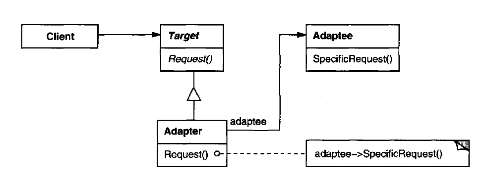

# Adapter Pattern

## Intent

Convert the interface of a class into another interface clients expect. Adapter lets classes work together that couldn't otherwise because of incompatible interfaces.

## Also known as

Wrapper

## When to use

1. If we want to use an existing library that has an interface different than our code requires.
2. If we want to easily change the existing libraries or have more than one used in the code, so we can define one Adapter interface, and adapt any number of different libraries in the different Adapter classes (Open / Closed Principle).

## Structure

  

- Target: defines the interface our code needs.
- Adaptee: the existing library that needs to be adapted.
- Adapter: adapts the adaptee to the required target interface.

## Examples

|        Source Code        |  UML   |
| :-----------------------: | :----: |
| [Example 1](example_1.ts) | _TODO_ |
| [Example 2](example_2.ts) | _TODO_ |

You can find the tests [here](index.test.ts).
