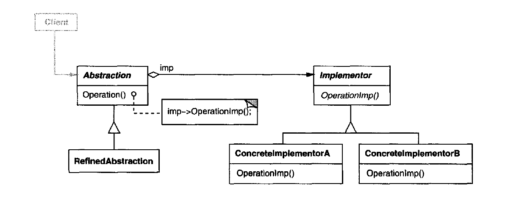

# Bridge Pattern

Decouples an abstraction from its implementation so that the two can vary independently.

## When to use

1. You want to decouple a huge monolithic class that's responsible for many things.
2. You want to avoid permenent binding between an abstraction and its implementation, especially when the implementation can be switched at run-time.
3. You want to avoid making many subclasses for each implementation if the abstraction is the same but has more than a valid implementation.

## Structure

  

- Abstraction: defines the abstraction's interface, and maintains a reference to an object of type Implementor.
- RefinedAbstraction: **optional** either extends the features of the abstraction, or makes a variant of the Abstraction.
- Implementor: defines the interface for implementation classes, usually the Implementor provides only primitive (low-level) operations, and then the Abstraction do a higher-level operation based on there primitives.
- ConcreteImplementor: implements the Implementor interface and defines its concrete implementation.

## Note

- Be careful as the more cohesive the class is, the harder it becomes to implement the bridge pattern and may introduce more complexity.
- The pattern is a great example for Single Responsibility Principle, as it decouples the different functionalities to its own interfaces and implementations.
- The pattern is also a great example for Dependency Inversion Principle, as after decoupling the different functionalities, the class will depend on an abstraction of the Implementor instead of the concrete implementations, also Dependency Injection will be used when explicitly defining the dependency of the Implementor in the constructor (or any other way of Dependency Injection).

## Examples

|        Source Code        |  UML   |
| :-----------------------: | :----: |
| [Example 1](example_1.ts) | _TODO_ |

You can find the tests [here](index.test.ts).
