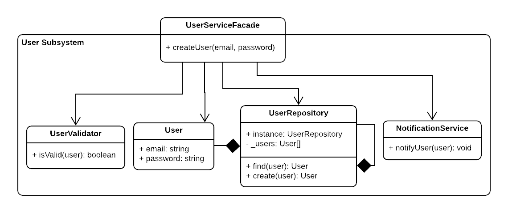

# Facade Pattern

Most of the times you will find yourself structuring the codebase into multiple subsystems, each subsystem has a few modules, and of course when trying to consume a subsystem functionality in any place in your code you'll find that it needs a few complex calls and operations to the subsystem internal modules.

## Intent

Provide a simple, unified interface to a set of interfaces in a subsystem. Facade defines a higher-level interface (more complex body) that make the subsystems easier to use and consume.

## When to use

1. When you need to have a limited but straightforward interface to a complex subsystem.
2. When there are many dependencies between client code and the subsystem classes, so a facade is introduced to decouple the client from the subsystem.
3. When you want to layer your subsystems, a facade can be used as an entry point to each level of the subsystem.

## Structure

  

- **Facade:** knows the subsystem classes and what they're responsible for, and delegates the client requests to the appropriate objects in the appropriate order.
- **Subsystem Classes:** they're the classes that form the subsystem (either a pre-existing package, a 3rd-party library or an API).

## Note

Remember that Facade pattern can easily become a **god object** with a lot of tightly coupled dependencies.

## Examples

|        Source Code        |                UML                |
| :-----------------------: | :-------------------------------: |
| [Example 1](example_1.ts) |  |

You can find the tests [here](index.test.ts).
