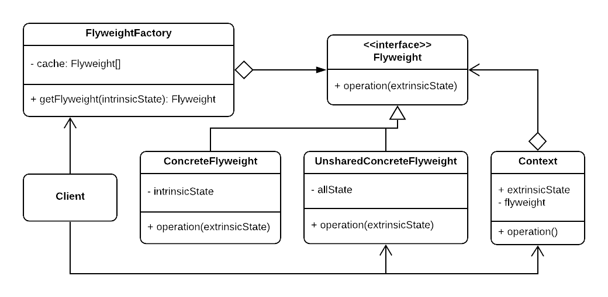
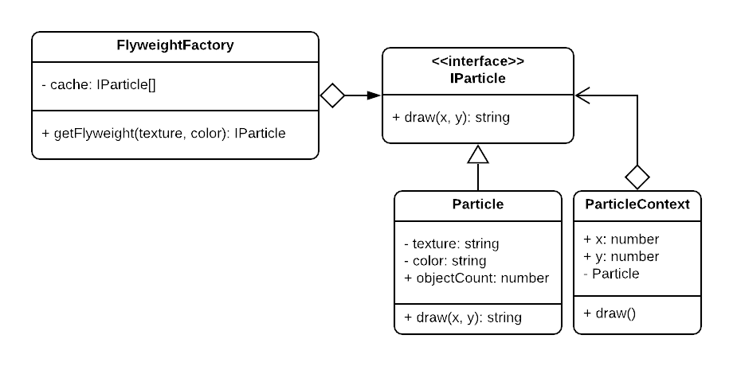

# Flyweight Pattern

In some software you may find a class that gets instantiated thousands, maybe millions of times **- as particles in video games-**. These object may share a lot of state with each other, the color, or texture for example, and this common state may cost a lot of ram making it impossible to instantiate such a number of objects.

## Intent

Fitting more objects into the available amount of RAM by sharing common parts of state between multiple objects instead of keeping all of the data in each object.

## When to use

1. Only when your program must support a huge number of objects which barely fit into available RAM.
2. These objects share common state **(intrinsic state)** that can be grouped together.
3. These objects have unique state **(extrinsic state)** that needs to be saved independently.
4. Your application doesn't depend on objects identity **(as they will be shared, so they can't be compared by reference comparison).**

## Structure

  

- **Flyweight:** declares the interface through which flyweights can receive and act on extrinsic state.
- **ConcreteFlyweight:** implements the flyweight interface and stores only the intrinsic state _(the state that'll be shared)_.
- **UnsharedConcreteFlyweight:** implements the flyweight interface but as this class has no shared state any state that's put in it should be state that's always unique, and doesn't affect the action (not extrinsic state) **(not all flyweight subclasses need to be shared. The flyweight interface enables sharing; it doesn't enforce it)**
- **FlyweightFactory:** creates and manages the flyweight object pool, also ensures the sharing of the flyweight objects so the client must use it to instantiate flyweights.
- **Client:** computes or stores the extrinsic state of flyweights.
- **Context:** sometimes it's not good to let the extrinsic state loose with the client (especially if it's more than one variable for each object), so the context defines the extrinsic state object, so the client can have the extrinsic state of the flyweights well structured.

## Note

Notice that the code now becomes much more complicated, and the state of an object is separated among two classes (the flyweight and its context), also you might be trading RAM for CPU if there's something to be calculated upon receiving the extrinsic state.

It's essential to make the shared flyweights as immutables, as many objects will depend on them during runtime.

## Examples

|        Source Code        |                UML                |
| :-----------------------: | :-------------------------------: |
| [Example 1](example_1.ts) |  |

You can find the tests [here](index.test.ts).
