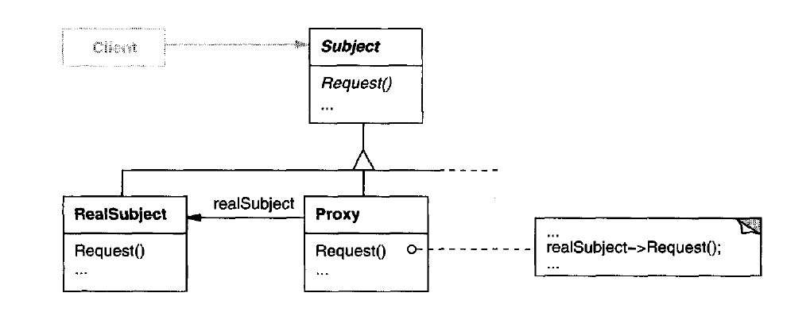

# Proxy Pattern

## Intent

Provide a substitute or a placeholder for another object to control access to it, allowing you to perform something either before or after the request gets through to the original object.

## When to use

1. When there's a need for a more vesatile or sophisticated reference to an object than a simple pointer.
2. When you have a heavyweight service object that wastes system resources by being always up, even though you only need it from time to time (Lazy Initialization).
3. Local execution of a remote service (remote proxy). This is when the service object is located on a remote server.
4. Caching request results (caching proxy). This is when you need to cache results of client requests and manage the life cycle of this cache, especially if results are quite large.
5. When you need to be able to dismiss a heavyweight object once there are no clients that use it.

## Proxy Types

1. **Remote Proxy**: provide a local representation for an object in a different address space. As in Client-Server apps the Client can encapsulate a Server Service in a proxy to hide the network logic behind the service.
2. **Virtual Proxy**: creates expensive objects on demand (lazy initialization), also may introduce optimizations to existing functionalities (as caching proxies).
3. **Protection Proxy**: controls the access to the original object, by putting different access rights on methods (as in role based authorization).
4. **Smart Reference**: from time to time, the proxy may go over the clients and check whether they are still active. If the client list gets empty, the proxy might dismiss the service object and free the underlying system resources.

## Structure

  

- Subject: defines the common interface for RealSubject and Proxy so that Proxy can be used anywhere as a RealSubject.
- RealSubject: defines the real object that the proxy represents.
- Proxy: has a reference field that points to a service object. After the proxy finishes its processing (e.g., lazy initialization, logging, access control, caching, etc.), it passes the request to the service object.

## Examples

|        Source Code        |  UML   |
| :-----------------------: | :----: |
| [Example 1](example_1.ts) | _TODO_ |
| [Example 2](example_2.ts) | _TODO_ |

You can find the tests [here](index.test.ts).
